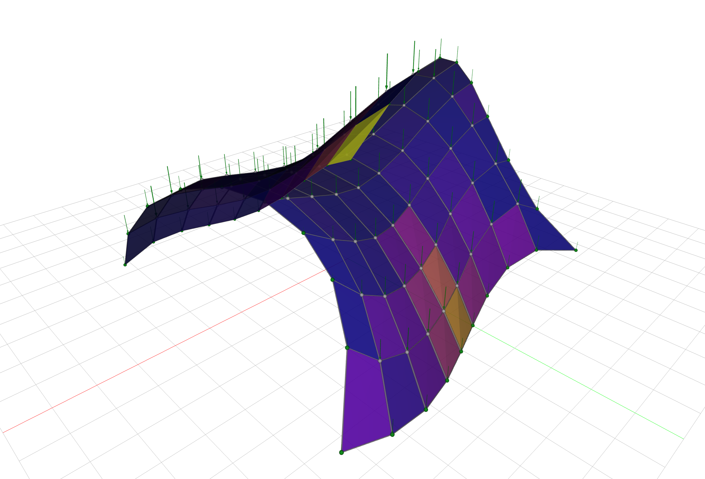

# Introduction to Differentiable Form-Finding with JAX FDM

Workshop at IASS 2026.

**Sunday, September 13th, 2026 / 13:00 - 18:00**



## Motivation

Form-finding computes funicular geometry for a structure: a shape that endows it with the ability to bear external loads predominantly through internal axial forces.
This load-bearing behavior allows a structure to be mechanically efficient relative to a system whose geometry is not form-found, thus leading to material economy.

While approaches like the force density method (FDM) have greatly simplified the tractable computation of funicular geometry in a forward way, these approaches offer limited support to design for target shapes that comply with fabrication and other technical constraints besides mechanical efficiency.
The reason is that this map from design requisites to shape descriptors poses an _inverse problem_.

Powered by recent advances in the machine learning tool stack, turning form-finding methods into **differentiable** computer programs opens up new pathways for lightweight structural designs by letting the **gradient**, a mathematical object encoding the direction of steepest ascent of a function, guide the search automatically toward constrained funicular geometry.

This workshop explores this idea by utilizing [JAX FDM](https://github.com/arpastrana/jax_fdm) in Python 🐍.

## Objectives

By the end of the workshop you should be able to:

1. **Explain how the force density method, automatic differentiation, and
   gradient-based optimization work** — and why combining them makes form-finding
   differentiable.
2. **Use JAX FDM to solve constrained form-finding tasks, assisted by agentic
   coding** — expressing design intent as goals and constraints, and working with an
   AI coding assistant to get there.

## Prerequisites

- Comfort reading and editing Python. No JAX experience required.
- Basic structural intuition (equilibrium, axial tension and compression).

## Installation

Pick your operating system and follow only that section. Install **Cursor** first,
open a terminal **inside Cursor**, then type every remaining command there.

### Windows

**1. Install Cursor**

Download the Windows installer from [cursor.com](https://cursor.com) and run it.
Open Cursor from the Start menu.

**2. Open a terminal in Cursor**

Choose **View → Terminal**, or **Terminal → New Terminal**, or press **Ctrl+`**
(Control and the backtick key, above Tab).

The tab should say `powershell`. If it says `cmd` or `Command Prompt`, click the
small arrow next to the `+` on the terminal panel and choose **PowerShell**. The
commands below will not work in Command Prompt.

**3. Install git**

```powershell
git --version
winget install --id Git.Git -e
```

Run the `winget` line only if `git --version` reports that git is not recognized.
Close the terminal panel and open a new one afterwards.

**4. Install uv**

```powershell
powershell -ExecutionPolicy ByPass -c "irm https://astral.sh/uv/install.ps1 | iex"
```

Close the terminal panel and open a new one so `uv` lands on your `PATH`, then
confirm:

```powershell
uv --version
```

**5. Get the repository**

```powershell
git clone https://github.com/arpastrana/jaxfdm-workshop.git
cd jaxfdm-workshop
```

Then in Cursor choose **File → Open Folder…** and select the `jaxfdm-workshop`
folder you just cloned. Open a terminal again in that window (it should still
say `powershell`).

**6. Create the environment**

```powershell
uv sync
```

**7. Check your setup**

```powershell
uv run python check.py
```

### macOS

**1. Install Cursor**

Download it from [cursor.com](https://cursor.com) and drag it into `/Applications`.
Open Cursor from Applications.

**2. Open a terminal in Cursor**

Choose **View → Terminal**, or **Terminal → New Terminal**, or press **Ctrl+`**
(Control and the backtick key, above Tab).

The tab will say `zsh` or `bash`. Either is fine.

**3. Install git**

macOS ships git with the Xcode Command Line Tools. Check and install if needed:

```bash
git --version
xcode-select --install
```

**4. Install uv**

```bash
curl -LsSf https://astral.sh/uv/install.sh | sh
```

Close the terminal panel and open a new one (**Terminal → New Terminal**) so `uv`
lands on your `PATH`, then confirm:

```bash
uv --version
```

**5. Get the repository**

```bash
git clone https://github.com/arpastrana/jaxfdm-workshop.git
cd jaxfdm-workshop
```

Then in Cursor choose **File → Open Folder…** and select the `jaxfdm-workshop`
folder you just cloned. Open a terminal again in that window.

**6. Create the environment**

```bash
uv sync
```

**7. Check your setup**

```bash
uv run python check.py
```

### What those last two commands do

`uv sync` installs the exact versions recorded in `uv.lock` — Python 3.12, JAX, and
JAX FDM 0.14.1 among them. You do **not** need to install Python yourself: this
repository pins Python 3.12 in `.python-version` and uv downloads it for you. Use
`uv sync --locked` if you want uv to fail rather than silently re-resolve when the
lockfile is out of date.

`check.py` reports your OS and architecture, verifies every required package imports,
confirms your Python and JAX FDM versions match the pins, and runs small JIT,
automatic differentiation, and plotting tests. A green report means you are ready:

```
Result
──────

  ✓  Everything looks good!
```

If anything fails, send a screenshot of the whole report to the instructor.

### Run an example

```bash
uv run python 01_form_finding/four_bars.py
```

Prefix every Python command with `uv run` — that is what puts the workshop
environment on the path.

### Supported machines

| Machine | Status |
| --- | --- |
| Windows, x64 | Supported |
| Apple Silicon Mac (M1 and later) | Supported |
| **Windows on ARM** | **Not supported — contact the instructor** |
| **Intel Mac** | **Not supported — contact the instructor** |


**If your machine is not supported, please contact the instructor before the workshop begins to find a workaround.**

## Workshop outline

1. **`00_jax` — a JAX primer.** Arrays with meaningful shapes, vectorizing with `vmap`, and the two derivative transformations, `grad` and `jacobian`.
2. **`01_form_finding` — equilibrium from scratch.** Derive the force density method, and see why prescribing force densities instead of forces turns a nonlinear problem into a linear one.
3. **`02_arches` — the arches.** Form-finding a real structure, and differentiating through the linear equilibrium solve.
4. **`03_gridshell` — constrained form-finding.** Goals, losses, and constraints on a gridshell with JAX FDM's optimization API.
5. **`04_cablenet` — a tensile cable-net.** Same method, opposite sign of `q`. Then goals on forces and lengths rather than on geometry.

## Working with an AI coding assistant

`AGENTS.md` holds the house rules for coding assistants in this repository — use the
public JAX FDM API, keep changes small and pedagogically transparent, don't solve
later exercises ahead of time. `CLAUDE.md` points Claude Code at the same file. Both
are worth skimming before you start prompting, and Cursor reads `AGENTS.md`
automatically.

## Resources

- [Differentiable FDM](https://doi.org/10.1016/j.cma.2026.118783) — scientific article explaining the theory behind JAX FDM
- [JAX FDM](https://arpastrana.github.io/jax_fdm/) — documentation, how-to guides, and examples
- [JAX](https://docs.jax.dev/) — official documentation
- [Cursor](https://docs.cursor.com/) — official documentation
